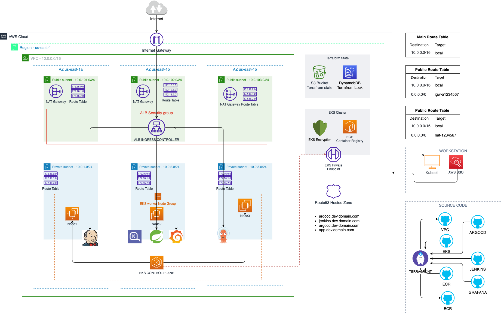

SIMPLE SPRING-BOOT APPLICATION
===

## 📋 Table of Contents

- [Project Overview](#project-overview)
- [Architecture](#architecture)
- [Tech Stack](#tech-stack)
- [Prerequisites](#prerequisites)
- [Quick Start](#quick-start)
- [Detailed Setup Guide](#detailed-setup-guide)
- [Monitoring & Alerts](#monitoring--alerts)
- [Troubleshooting](#troubleshooting)
- [Contributing](#contributing)
- [License](#license)

## 🎯 Project Overview

This project implements a complete GitOps workflow on AWS with automated infrastructure provisioning, continuous integration/deployment, and comprehensive monitoring.
The application is a JAVA web application, deployed on Amazon EKS.

### Key Features:
- **Infrastructure as Code**: Complete AWS infrastructure managed with Terraform
- **CI/CD Pipeline**: Jenkins automated build and deployment pipeline
- **GitOps Workflow**: ArgoCD for Kubernetes deployment automation
- **Container Orchestration**: Kubernetes with EKS for scalable deployments
- **Load Balancing**: AWS ALB with SSL termination via ACM
- **Monitoring**: Prometheus metrics collection with Grafana visualization
- **Security**: RBAC, secrets management, and network security groups

## 🏠 Architecture



## 🛠️ Tech Stack

### Infrastructure & DevOps
- **Terraform** - Infrastructure as Code
- **AWS EKS** - Kubernetes cluster
- **AWS ECR** - Container registry
- **AWS EFS** - Persistent storage
- **AWS ALB** - Load balancer
- **AWS ACM** - SSL certificates
- **Route 53** - DNS management

### CI/CD & GitOps
- **Jenkins** - CI/CD pipeline
- **ArgoCD** - GitOps deployment
- **Docker** - Containerization
- **GitHub** - Source code & GitOps repo

### Monitoring & Observability
- **Prometheus** - Metrics collection
- **Grafana** - Visualization & dashboards
- **AlertManager** - Alert management

### Application
- **Python Django** - Web application
- **MySQL** - Database
- **Kubernetes** - Container orchestration

## 📋 Prerequisites

Before starting, ensure you have the following:

### Required Software
- [Terraform](https://www.terraform.io/downloads.html) (v1.0+)
- [AWS CLI](https://aws.amazon.com/cli/) (v2.0+)
- [kubectl](https://kubernetes.io/docs/tasks/tools/) (v1.24+)
- [Docker](https://www.docker.com/products/docker-desktop/) (v20.0+)
- [Git](https://git-scm.com/downloads) (v2.30+)

### AWS Account Requirements
- AWS account with appropriate permissions
- S3 bucket for Terraform backend (create manually first)
- Domain name for Route 53 (optional but recommended)

### GitHub Requirements
- GitHub account
- Personal access token with repo permissions
- Two repositories:
  - Main application repository
  - GitOps repository for Kubernetes manifests

## 🚀 Quick Start

```bash
cd infrastructure/non-prod/us-east-1/dev
terragrunt init --all -upgrade
terragrunt plan --all

terragrunt apply --terragrunt-working-dir ../../us-east-1/dev/data-sources
terragrunt apply --terragrunt-working-dir ../../us-east-1/dev/eks-cluster

terragrunt apply --all -auto-approve
```

### Check access to Kubernets

```bash
aws eks update-kubeconfig \
  --name spring-boot-dev \
  --region us-east-1 \
  --profile dev-administrator-access \
  --kubeconfig $HOME/.kube/spring-boot-dev-dev-administrator-access

export KUBECONFIG=$KUBECONFIG:$HOME/.kube/spring-boot-dev-dev-administrator-access
```

### 🖥️ Destroy

```bash
cd infrastructure/non-prod/us-east-1/dev
terragrunt run-all destroy

find . -type d -name ".terragrunt-cache" -prune -exec rm -rf {} \;
```